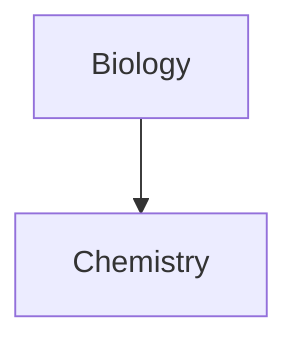
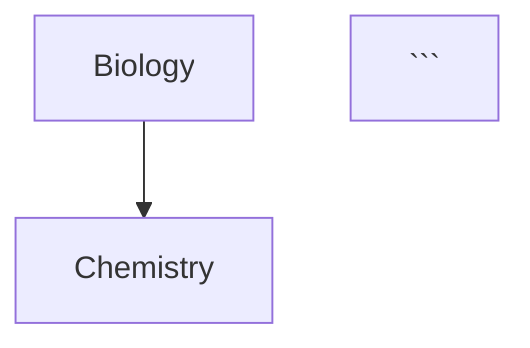

## Table

1. 表格两侧的竖线是可选的
2. 列不需要完全对齐，表头行至少需要两个连字符

```markdown
First name | Last name
-- | --
Max | Planck Marie | Curie
```

在表中使用 [[Note Alias|alias]] 或者 [[Embed File#embed image|resize image]]，需要对 | 进行转义：

```markdown
First column | Second column
-- | --
[[Basic formatting syntax\|Markdown syntax]] | ![[og-image.png\|200]]
```

使用: 设置对齐方式：

```markdown
Left-aligned text | Center-aligned text | Right-aligned text
:-- | :--: | --:
Content | Content | Content
```

Left-aligned text | Center-aligned text | Right-aligned text
:-- |:--: | --:
Content | Content | Content

## Diagram

> [!tip]
> 可以使用 [Live Editor](https://mermaid-js.github.io/mermaid-live-editor/edit) 编辑 diagram，然后再嵌入文档

使用 internal-link 类创建 [[Internal Link]]：

```markdown


如果节点较多，可以使用下面 snippet：

```markdown


## Paragraph

默认多个空格会被压缩为单个空格（与 HTML 的行为类似）。如果要添加多个空格，可以使用 `&nbsp` 和 `<br>`

## External Link

可以通过 [[Obsidian URI]] 链接到其它仓库的文件

```markdown
[Note](obsidian://open?vault=MainVault&file=Note.md)
```

链接中的空格需要使用 `%20` 转义：

```markdown
[My Note](obsidian://open?vault=MainVault&file=My%20Note.md)
```

也可以使用 `<>` 进行转义：

```markdown
[My Note](<obsidian://open?vault=MainVault&file=My Note.md>)
```

## List

使用 `Tab` 或 `Shift+Tab` 对列表项目进行缩进或取消缩进。

## Task List

创建 Task：

```markdown
- [x] This is a completed task.
- [ ] This is an incomplete task.
```

## Footnote

语法：

```markdown
This is a simple footnote[^1].

[^1]: This is the referenced text.
[^2]: Add 2 spaces at the start of each new line.
  This lets you write footnotes that span multiple lines.
[^note]: Named footnotes still appears as numbers, but can make it easier to identify and link references.
```

行内脚注（==注意 ^ 位于括号外==）：

```markdown
You can also use inline footnotes. ^[This is an inline footnote.]
```

## Comment

使用 \%\% 对文本进行注释：

```markdown
This is an %%inline%% comment. 

%%
This is a block comment.

Block comments can span multiple lines.
%%
```

## Callout

类型标识符大小写不敏感。

可以在类型标识符后面增加 `+` 或 `-` 使 callout 可折叠，`+` 默认展开，`-` 默认折叠

```markdown
> [!faq]- Are callouts foldable?
> Yes! In a foldable callout, the contents are hidden when the callout is collapsed.
```

> [!faq]- Are callouts foldable?
> Yes! In a foldable callout, the contents are hidden when the callout is collapsed.

### 嵌套 Callout

```markdown
> [!question] Can callouts be nested?
> > [!todo] Yes!, they can. 
> > > [!example] You can even use multiple layers of nesting.
```

> [!question] Can callouts be nested?
> 
> > [!todo] Yes!, they can.
> > 
> > > [!example] You can even use multiple layers of nesting.

### 自定义 Callout

```markdown
.callout[data-callout="custom-question-type"] {
	--callout-color: 0, 0, 0;
	--callout-icon: lucide-alert-circle;
}
```

- data-callout 定义类型标识符为 custom-question-type
- --callout-color 定义背景色
- --callout-icon 定义图标：
	- [lucide.dev](https://lucide.dev/) 的图标 id
	- SVG 定义：`--callout-icon: '<svg>...custom svg...</svg>';`

## Edit and Preview

通过编辑器右上角的书本或者铅笔图标切换编辑或预览视图时，同时按下 Cmd 键，可以实现并排同时打开编辑和预览视图。

## Embed Web Page

通过下面方式嵌入网页：

```html
<iframe src="INSERT YOUR URL HERE"></iframe>
```

> [!NOTE]
> 有些网站不支持嵌入，相反，它们会提供专门用于嵌入的 URL，可以通过以下方式搜索：“网站名称”+“embed iframe”，如：youtube embed iframe

YouTube 和 Twitter 可以通过 [[Embed File#Embed Image|embed image]] 方式嵌入：

```markdown

```

```markdown

```

## Folding

通过命令面板，可以折叠或取消折叠：

- Fold all headings and lists
- Unfold all headings and lists
- Fold less: 对鼠标所在区域取消折叠，可设置快捷键
- Fold more: 对鼠标所在区域折叠，可设置快捷键

## Metadata

> [!tip]
> metadata 默认只会在 edit view 模式下可见。可以通过 Settings -> Editor -> Show frontmatter 设置在 read view 模式下也可见。

预定义的 metadata：

|Key|Description|
|---|---|
|`tag`|See [[#Tag]]|
|`tags`|Alias for `tag`.|
|`alias`|See [[Note Alias|Aliases]]|
|`aliases`|Alias for `alias`.|
|`cssclass`|Allows you to style individual notes using [[CSS snippets]]|

## Multiple Cursor

长按 Option 键，可以选择多个文本（Vim 需要在正常模式下选择）

矩形选择：选择多行时，同时按下 Shift+Option，可以选择矩形区域

## Obsidian Flavored Markdown

Obsidian 主要使用 [CommonMark](https://commonmark.org/)，同时也集成了 [GitHub Flavored Markdown](https://github.github.com/gfm/) 和 LaTeX 的功能。

此外，Obsidian 还添加了以下语法：

|Syntax|Description|
|---|---|
|`[[ ]]`|[[Internal Link]]|
|`![[ ]]`|[[Embed File]]|
|`%%`|[[#Comment]]|
|`> [!note]`|[[#Callout]]|

## Tag

定义 Tag 的两种方式：

- `#tag`
- meta 中定义

[[搜索]] 时，可通过 tag 过滤，如 `tag:#meeting`

可以定义嵌套 tag，如 `#inbox/to-read`、`#inbox/processing`
